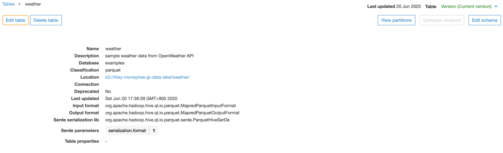
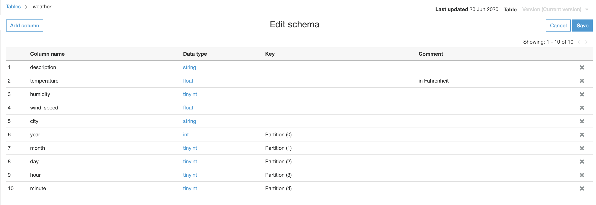
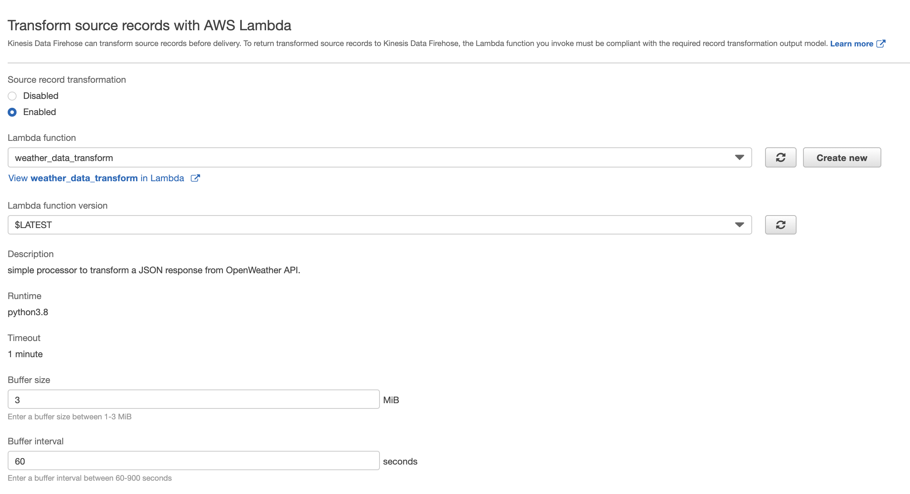
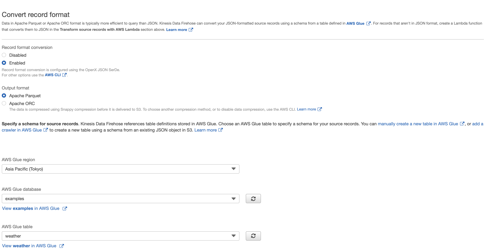
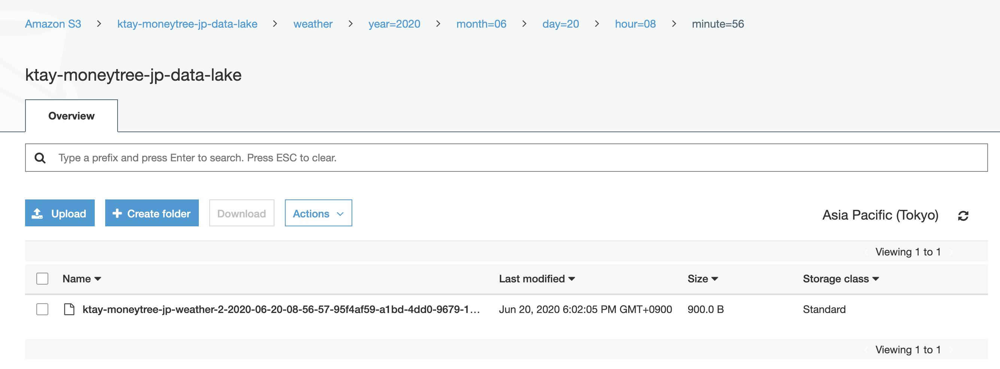
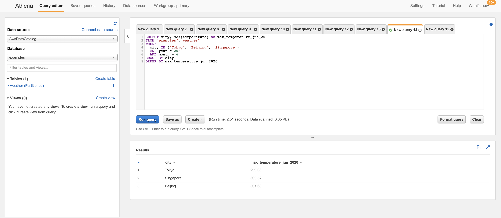

# Weather Data :cloud:

This is a sample project (mainly instructions) that showcase potential ETL workflows through the use of:

- AWS Kinesis Firehose (delivery stream)
- AWS Lambda (data transformation)
- AWS Glue Table (data definition)
- AWS S3 (data lake)
- AWS Athena (analytics)

For a quick read on some of the mentioned AWS services above, please see [Components](components.md)

## Objective

Let's imagine we:

have a background worker that polls weather data over major cities via OpenWeather API and publishes the JSON to a Kinesis Firehose.

want to query the weather data in terms of temperature, weather description, wind speed and the location over time.

We can design an AWS Glue Table definition that would encapsulate this information, so our users can query this on AWS Athena.

Particularly, we want to setup partitioning on this dataset as well.

The [sample JSON response](https://samples.openweathermap.org/data/2.5/weather?q=London,uk&appid=439d4b804bc8187953eb36d2a8c26a02) from OpenWeather API is rather rich.

However, for the sake of simplicity and showcasing data transformation with Lambda, we want to reduce our data definition to simply:

```json
# reduced JSON
{
  "description": "light intensity drizzle",
  "temperature": 280.32,
  "wind_speed": 4.1,
  "humidity": 81,
  "city": "London"
}
```

## Setup

### S3

First, let's setup an S3 bucket as our data lake.

In this example, I have created a bucket `ktay-moneytree-jp-data-lake`.

We would also add a new `weather` folder in this bucket to store the weather data.

This will be referenced later as the output destination for Kinesis Firehose.

### Lambda

Create a Lambda that would be hooked up with the Kinesis Firehose delivery stream.

In this example, I have created a Lambda function in Python 3.8.
> [View the source code here](code/lambda.py)

### Glue Table

Let's create a Glue table definition that describes the weather data.

Head to AWS Glue console, and create a new Glue database called `examples`.

Create a new table `weather` under this `examples` database.

We will select format as Apache `Parquet` for now, and `S3` as source.
As you can probably guess, the S3 source location would be set to s3://ktay-moneytree-jp-data-lake/weather/



For the table schema, you can set up as follow:



### Kinesis Firehose

This is the main component that ties up the Lambda, S3 and Glue Table components.

Here, I created a Firehose delivery stream, `ktay-moneytree-jp-weather`.

Under the `Transform source records with AWS Lambda` section, select `Enabled` and pick the Lambda function we've uploaded to AWS.



Under the `Convert record format` section, select `Enabled` and set output format as `Apache Parquet`.

We then select our defined Glue Table above.



Next, we set up the destination to our S3 bucket.

**NOTE**

We added the prefix:

```
weather/year=!{timestamp:YYYY}/month=!{timestamp:MM}/day=!{timestamp:dd}/hour=!{timestamp:HH}/minute=!{timestamp:mm}/
```

This means, if a stream record is ingested at 2020-06-20 08:56 UTC, it would be found at:

https://ktay-moneytree-jp-data-lake.s3-ap-northeast-1.amazonaws.com/weather/year%3D2020/month%3D06/day%3D20/hour%3D08/minute%3D56/ktay-moneytree-jp-weather-2-2020-06-20-08-56-57-95f4af59-a1bd-4dd0-9679-127e4a7d06cc.parquet



Notice that the file extension above. It is a Parquet file indeed.

> :bulb: You can use a tool like [parquet-cli](https://github.com/chhantyal/parquet-cli) to inspect the Parquet file if needed.

The syntax `year={}/month={}/day={}/hour={}/minute={}` is significant, as this is how AWS Glue Table locates the partition by.
> https://docs.aws.amazon.com/athena/latest/ug/partitions.html#partitions-preparing-data

Hence, we would have the partitions `year`, `month`, `day`, `hour`, `minute`.

> Of course, this is overdone, and we could have simplified the partition(s) to just a full datetime or UNIX timestamp, for time partitioning.

For more customization rules on the prefixes, please see https://docs.aws.amazon.com/firehose/latest/dev/s3-prefixes.html

## Generating Data

For a sample project, we will feed data manually to the Kinesis Firehose, with the AWS CLI tool.

I've prepared a [simple shell script](code/firehose.sh) that would query current weather data in various cities through OpenWeather API.

If [using AWS Vault](https://github.com/99designs/aws-vault), you can thus do something like:

```sh
# remember to change the env vars in the script:
#   - OPENWEATHER_API_KEY
#   - KDF_STREAM_NAME
aws-vault exec [your profile] -- sh code/firehose.sh
```

Head to the S3 bucket after some time, and you should find the transformed data as Parquet files!

## Tying it all together: Query

Awesome, we can now query our datasets in S3 through Athena now. This

Head to the AWS Athena console, and select the `examples` AWS Glue database, and the `weather` table.

```sql
-- first, reload all partitions
MSCK REPAIR TABLE weather;
```

```sql
-- example query
SELECT city, MAX(temperature) as max_temperature_jun_2020
FROM "examples"."weather"
WHERE
  city IN ('Tokyo', 'Beijing', 'Singapore')
  AND year = 2020
  AND month = 6
GROUP BY city
ORDER BY max_temperature_jun_2020;
```



That's it! :sake:

## Concluding

We can go further with the described AWS Glue Table.

You could be building further ETL pipelines with AWS Glue Jobs fetching partitioned data from the table [via DynamicFrame](https://docs.aws.amazon.com/glue/latest/dg/aws-glue-api-crawler-pyspark-extensions-dynamic-frame.html).

Naturally, well-partitioned data ensures the query is efficient, so that our Glue job are more efficient overall too.

Your Engineering and Finance team would be thankful overall :)
